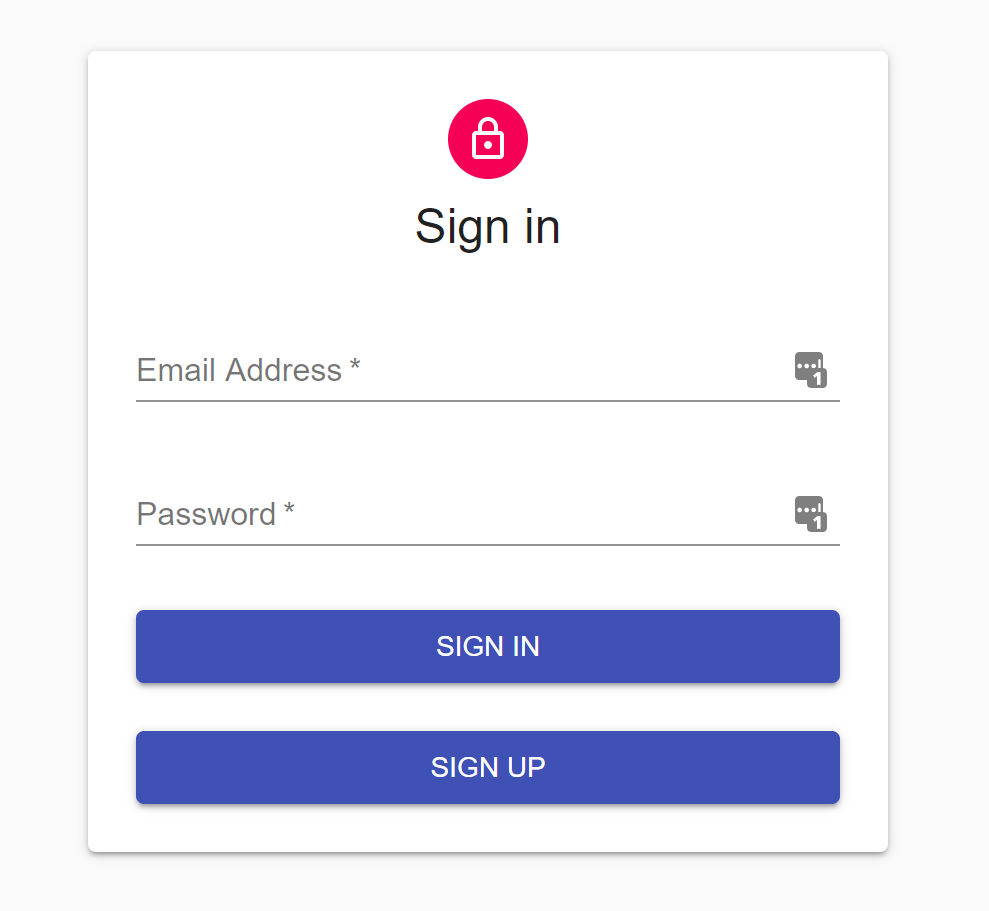
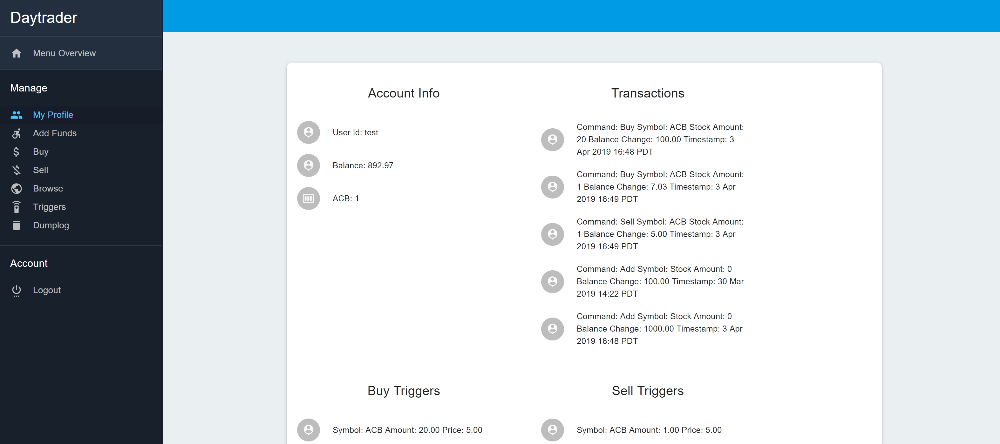
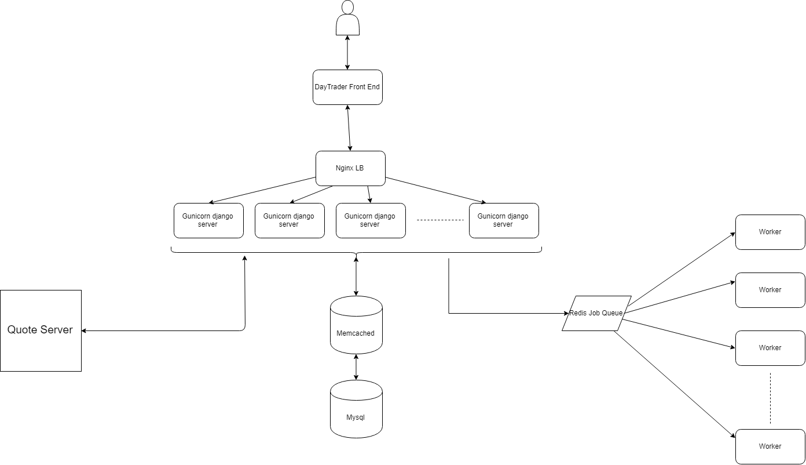
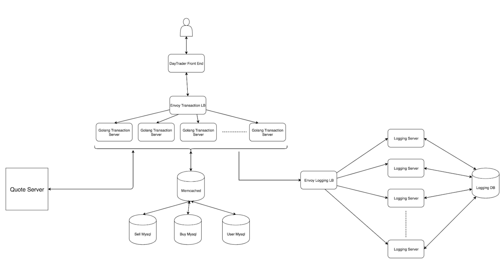

# Day_Trader

Day trader is a stock exchange platform built for performance and reliability.

## Usage

In order to use the current version(golang) you need to docker-compose up in several different directories:

1. in frontend `docker-compose up`
2. in golang/day_trader `docker-compose up`
3. in golang/logging `docker-compose up`
4. in quote_server `docker-compose up`

## Design

This project is implemented in 2 different ways:

### Django(Old version)
- Rest communication
- Nginx LB
- Redis job queue
- Django_rq workers
- Memcached for caching
- Mysql DB

### Golang(Current version)

Front end:
- React

Backend:
- GRPC communication
- Envoy LB
- Memcached for caching
- Mysql Db

## Development

In order to use the current version(golang) you need to docker-compose up in several different directories:

1. in frontend `docker-compose up`
2. in golang/day_trader `docker-compose up`
3. in golang/logging `docker-compose up`
4. in quote_server `docker-compose up`

## Generator

To run the generator you must have completed the previous development step.

1. in golang/workload_generator `docker-compose up`
2. The workload file can be changed to simulate different user workloads

## Quote server

To run the quote server, `cd quote_server` and run `docker-compose up`

## Testing

### Golang

To test the golang app, `cd golang/day_trader/test_infrastructure` then run `docker-compose up`

__Note - Since this uses a real db and cache, you must docker-compose down every time you want to retest__
